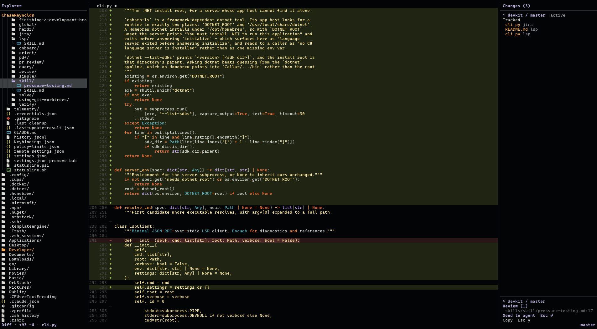

# Vincent

A mouse-first terminal client for reviewing code that AI agents wrote, and
correcting it in place. Vincent van *Go*.



Your agent writes the code. Vincent shows you the diff, you click a line
and leave a note, and one keypress drops those notes back into the
agent's prompt. When a fix is smaller than a note, you type it yourself.

## What it does

- A file tree, and a Zed-shaped **Changes panel** that lists every
  tracked and untracked file, grouped by repository when you point
  Vincent at a folder of repos.
- **Inline diffs**: dual old/new gutters, `±` markers, and a darker
  word-level tint on just the part of a line that changed.
- **Review notes** that click onto a diff line and land in the agent's
  prompt through [herdr](https://github.com/herdrdev/herdr), or on the
  system clipboard when there's no pane to send to.
- A small real **editor** — type, select, undo, find and replace, save —
  with a conflict check that refuses to overwrite a file the agent
  rewrote out from under you.
- Rendered **markdown**, toggled per tab.
- **Find in files** across the project.
- Four blunt git writes: save a buffer, `git checkout` a branch,
  commit everything tracked and untracked in one shot, `git push`.
  Nothing finer — no staging, no amend, no rebase. That's lazygit's job.

## The review loop

`Esc r` on a diff line opens a small composer. Cycle its kind with Tab —
issue, suggestion, question, praise, or none — write a note, and it joins
the batch in the git panel's footer. `Esc ⏎` sends the whole batch to the
agent; `Esc y` copies it to the clipboard instead.

A note never touches the source. What it anchors to is a frozen snippet
of the diff, captured the moment you wrote the note, so the batch stays
true to what you actually reviewed even after the agent rewrites the
file and the line numbers move on.

This is what a batch looks like once it reaches the agent:

```
Please address these review comments.
Comment kinds: ISSUE (must fix), SUGGESTION (consider)

## Comments

1. **[ISSUE]** `internal/app/gitpanel.go:214`
   +	if len(entries) == 0 {
   this drops the empty-repo case; the header should still say Changes (0)

2. **[SUGGESTION]** `internal/app/gitpanel.go:240-244`
   +	for _, e := range entries {
   +		rows = append(rows, row(e))
   +	}
   could be a single append with a mapped slice, but not blocking
```

## Keys

Press `Esc` to arm the leader — you have 1.5 seconds to press one more
key before it disarms. `Esc` again cancels. There are no `Ctrl+`
shortcuts; they fight tmux and terminal emulators. `Esc ?` shows this
same table inside the app, generated from the same source, so it can
never drift out of date. A few actions also live on the right-click
menu, but every one of them is on this list too — right-click is a
redundant path, never the only one.

**Review**

| Key | Does |
|---|---|
| `Esc d` | Diff |
| `Esc e` | Open file |
| `Esc r` | Note |
| `Esc y` | Copy review |
| `Esc g` | Changes |
| `Esc ⏎` | Send |

**Git**

| Key | Does |
|---|---|
| `Esc c` | Commit |
| `Esc P` | Push |
| `Esc b` | Branch |

**Search**

| Key | Does |
|---|---|
| `Esc p` | Find file |
| `Esc /` | Find |
| `Esc F` | Find in files |

**View**

| Key | Does |
|---|---|
| `Esc f` | Explorer |
| `Esc t` | Tab bar |
| `Esc z` | Fold all |
| `Esc m` | Markdown |
| `Esc o` | Root |

**Edit**

| Key | Does |
|---|---|
| `Esc s` | Save |
| `Esc S` | Save as |
| `Esc n` | New file |
| `Esc u` | Undo |
| `Esc U` | Redo |
| `Esc a` | Select all |

**Session**

| Key | Does |
|---|---|
| `Esc w` | Close |
| `Esc q` | Quit |
| `Esc ?` | Keys |

## Install

```sh
go install github.com/chasereyn/vincent@latest
```

Or download a binary from the
[Releases page](https://github.com/chasereyn/vincent/releases):
`vincent-darwin-arm64`, `vincent-linux-amd64`, `vincent-windows-amd64.exe`.

Or clone and build:

```sh
git clone https://github.com/chasereyn/vincent
cd vincent
make install        # builds, then copies to ~/.local/bin
```

**macOS**: the release binary is unsigned. On first launch, macOS
quarantines it; clear that with:

```sh
xattr -d com.apple.quarantine ./vincent-darwin-arm64
```

Requires Go 1.24+ and `git` on PATH to build. No cgo, no runtime, no
external rendering tools at run time.

Vincent's review handoff prefers [herdr](https://github.com/herdrdev/herdr),
a terminal multiplexer for agent panes. Without it — or without an agent
pane running — `Esc ⏎` falls back to copying the review batch onto the
system clipboard instead of delivering it directly.

## Config

`~/.config/vincent/config.json`, all keys optional:

```json
{
  "icons": "auto",
  "tabBar": false,
  "recentRoots": []
}
```

- `icons` — `"auto"` (default) detects a Nerd Font at startup; `"on"` /
  `"off"` force it either way.
- `tabBar` — show the full tab strip. Default `false`: with one tab open,
  row 0 just names it until you turn the strip on.
- `recentRoots` — folders `Esc o` offers, most recent first. Vincent
  rewrites this on every root switch; entries that no longer exist are
  dropped on load.

Failed herdr sends log their full error to `~/.config/vincent/herdr.log`
rather than the terminal, which a raw-mode TUI would otherwise paint over.

## Design rules

- `#030405` background, set explicitly, never inherited from the
  terminal.
- Ayu Darker palette, matched to one specific Zed setup.
- Mouse first: click, drag, and scroll work everywhere; keyboard is the
  supplement.
- Single static binary — no cgo, no runtime, nothing shelled out to at
  run time except `git` and `herdr`.
- Four writes, all blunt, and nothing finer.
- `Esc` leader only, no `Ctrl+` chords, no menu.

## Provenance

Forked from [spice-edit](https://github.com/cloudmanic/spice-edit)
(Cloudmanic, LLC, MIT). Upstream file headers keep their original
authorship — that's the MIT attribution requirement, not a leftover.

Shaped by reading, not copying, these projects:
[herdr](https://github.com/herdrdev/herdr) — the pane-send handoff.
[tuicr](https://github.com/agavra/tuicr) — the review-note wire format.
[herdr-sidebar](https://github.com/alexarthurs/herdr-sidebar) — the inline
diff renderer's origin. [herdr-reviewr](https://github.com/persiyanov/herdr-reviewr)
— the herdr client and its error handling. [lazygit](https://github.com/jesseduffield/lazygit)
— why Vincent's git writes stop at four. [Zed](https://github.com/zed-industries/zed)
— the Changes panel's shape and the palette.

## Contributing

This is a personal tool, built for one person's review workflow. See
[CONTRIBUTING.md](CONTRIBUTING.md): pull requests are closed
automatically, bug reports are welcome, forks are welcome.

## License

MIT.

```
Copyright (c) 2026 Chase Reynolds.
Copyright (c) 2026 Cloudmanic, LLC. (spice-edit, from which this is forked)
```

See [LICENSE](LICENSE) for the full text.
